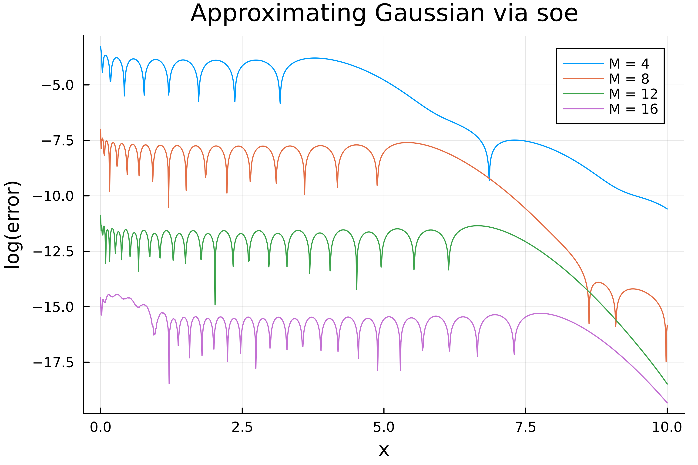
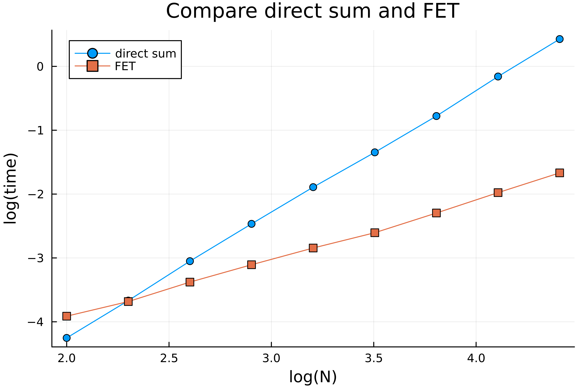

# SumOfExpVPMR.jl

[](https://github.com/HPMolSim/SumOfExpVPMR.jl/actions/workflows/CI.yml?query=branch%3Amain)
[](https://travis-ci.com/HPMolSim/SumOfExpVPMR.jl)
[](https://codecov.io/gh/HPMolSim/SumOfExpVPMR.jl)


`SumOfExpVPMR.jl` is a `Julia` implentation the VPMR method by Zixuan Gao, Jiuyang Liang and Zhenli Xu in [A Kernel-Independent Sum-of-Exponentials Method](https://link.springer.com/10.1007/s10915-022-01999-1), which can be used to represent rapid decaying kernels via sum of exponentials.

## Getting Started

Add this package in julia by typing `]` in Julia REPL and then
```julia
pkg> add SumOfExpVPMR
```
to install the package.

The main function is
```julia
function VPMR_cal(
    f::Function, # function to be approximated, be like f(x::T) where{T<:Real}, and make sure it can produce highly accurate result for BigFloat
    nc::T, # width of soe
    n::Int, # terms of soe in VP
    N::Int, # order of Gaussian integral
    p::Int; # terms of MR
    T1::DataType = ComplexF64, # output type for s and w
    T2::DataType = Float64, # output type for \sigma
    digit::Int = 1024,
    print_info::Bool=false
    ) where{T}
```
for details please refer to the article.

Here is an example of using VPMR, where we find a 12 term approximation for Gaussian function:
```julia
julia> using SumOfExpVPMR

julia> f = x -> exp(-x^2)
#58 (generic function with 1 method)

julia> sw12, σ12 = VPMR_cal(f, 4.0, 40, 100, 12, print_info = true);
[ Info: VP error: 1.2159077902284768438357759665040000333168536446025393484114289668230574315365e-12
[ Info: MR error: 1.331145872202156879583878373566408054787581766492969993446545399873793531071339e-11
[ Info: Truncated MR error: 1.3310907931440852e-11
```

More benchmark is shown in the following figure, the code can be found in the `expamle` folder.



## Usage

The SOE approach is quite useful since the $\exp(\cdot)$ function is easy to be handled.
One of the most important usage is called the fast exponential transform (FET), which can be used to calculate the summation $\sum_{i,j} q_{1}^{i} q_{2}^{j}  f \left( α^{-1} |x_i - x_j| \right)$ in $O(N)$ steps.
For details, please see the implentation in `src/fast_exp_transform.jl`.
Here we compare the cost of calculating $\sum_{i,j} q_{1}^{i} q_{2}^{j} \exp \left( -(x_i - x_j)^2 \right)$ directly and via FET, as shown in fig below.



## How to Contribute

If you find any bug or have any suggestion, please open an issue.

## References

1. The VPMR article [A Kernel-Independent Sum-of-Exponentials Method](https://link.springer.com/10.1007/s10915-022-01999-1).
2. [Matlab implementation of VPMR](https://github.com/ZXGao97/VPMR)
3. [C++ implementation of VPMR](https://github.com/TLCFEM/vpmr)
